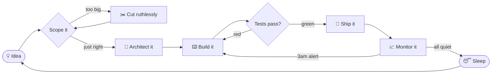

<div align="center">
  
</div>

<div align="center">
  <picture>
    <source media="(prefers-color-scheme: dark)" srcset="https://readme-typing-svg.demolab.com/?font=Inter&weight=600&size=21&duration=3200&pause=1000&center=true&vCenter=true&width=780&height=50&color=E6EDF3&lines=Sr.+Full+Stack+Developer+%26+Solution+Architect;Web+apps+%C2%B7+Mobile+apps+%C2%B7+AI+features+%C2%B7+Cloud+infrastructure;6%2B+years%2C+one+engineer%2C+the+whole+stack%2C+production-ready" />
    
  </picture>
</div>

<div align="center">
  <a href="#whoami"><kbd> whoami </kbd></a>&nbsp;&nbsp;<a href="#work"><kbd> work </kbd></a>&nbsp;&nbsp;<a href="#experience"><kbd> experience </kbd></a>&nbsp;&nbsp;<a href="#toolbox"><kbd> toolbox </kbd></a>&nbsp;&nbsp;<a href="#activity"><kbd> activity </kbd></a>&nbsp;&nbsp;<a href="#contact"><kbd> contact </kbd></a>
</div>

<br/>

<p align="center">
  <a href="https://muneeb-nawaz-portfolio.netlify.app/"></a>&nbsp;
  <a href="https://www.upwork.com/freelancers/~01113fcaa500ee9108"></a>&nbsp;
  <a href="mailto:muneeb.fusion@gmail.com"></a>
</p>

<p align="center"><b>🟢 Open to remote contracts, worldwide</b></p>

<br/>

<a name="whoami"></a>

> ### “I architect and ship secure, scalable systems end to end.”
>
> One engineer who takes a product from the first architecture sketch to live production traffic: the web app, the mobile apps, the AI, and the cloud it all runs on. I have done exactly that for six-plus years.

```text
      ███╗   ███╗███╗   ██╗      muneeb@remote
      ████╗ ████║████╗  ██║      ─────────────────────────────────────────────────
      ██╔████╔██║██╔██╗ ██║      Role       Sr. Full Stack Developer & Solution Architect
      ██║╚██╔╝██║██║╚██╗██║      Uptime     6+ years in production
      ██║ ╚═╝ ██║██║ ╚████║      Kernel     TypeScript / Python
      ╚═╝     ╚═╝╚═╝  ╚═══╝      Shell      web · mobile · AI · cloud, end to end
                                 Packages   18 shipped products (9 web · 9 mobile)
                                 Display    production-ready, whole stack, one person
                                 Location   remote · worldwide
                                 Status     open to remote contracts
```

<table>
  <tr>
    <td align="center" width="25%"><h3>🌐</h3><b>Web apps</b><br/><br/><sub>React, Next.js, Vue &amp; Angular frontends. Node, NestJS, Django &amp; FastAPI backends.</sub></td>
    <td align="center" width="25%"><h3>📱</h3><b>Mobile apps</b><br/><br/><sub>React Native and Expo for iOS and Android. Offline-first, push, deep linking, store-deployed.</sub></td>
    <td align="center" width="25%"><h3>🤖</h3><b>AI features</b><br/><br/><sub>RAG, agents, and conversational AI with OpenAI, Anthropic, and Gemini. Structured outputs included.</sub></td>
    <td align="center" width="25%"><h3>☁️</h3><b>Cloud infra</b><br/><br/><sub>AWS &amp; GCP with Docker, Kubernetes, Terraform &amp; GitOps. CI/CD that ships itself.</sub></td>
  </tr>
</table>

### How I ship

Every engagement runs the same pipeline. No hand-offs, no waiting on another team.



<br/>

---

<a name="work"></a>

## Selected work: Web

> **Nine web products.** I designed, built, and shipped each one end to end: frontend, backend, data, and deploy.

| Project | What it is | Built with |
|:--|:--|:--|
| 🔐 **Gluu&nbsp;Flex** | Admin console for an enterprise identity and access platform (Linux Foundation Janssen Project): SSO, MFA, passkeys, OIDC/OAuth2, SAML, and browser-side Cedar authorization compiled to WASM. | <sub>React 19 · TypeScript · Cedar/WASM · React Query · MUI</sub> |
| 🎓 **Streamlyne** | Cloud research-administration platform for universities. Runs the full sponsored-research lifecycle from proposals to awards to compliance, plus AI funding discovery and an enterprise assistant. | <sub>React · Python · REST · Kuali Rice · AI</sub> |
| 🛒 **AAS&nbsp;Platform** | Bilingual marketplace for home and commercial services: contractor bidding, staged Stripe payments, tiered memberships, role-based dashboards. | <sub>React 19 · Vite · Redux Toolkit · Node/Express · MongoDB · Stripe · AWS S3</sub> |
| 🤖 **Head&nbsp;Office&nbsp;AI** | No-code platform for building AI TeamAgents with personalities. Deploys to a web portal, widget, WhatsApp, or API. | <sub>Angular · Express/Socket.IO · OpenAI · Stripe</sub> |
| 🧭 **Evolo&nbsp;AI&nbsp;Web** | K-12 and adult education platform: job matching, employer matching, career exploration, AI guidance, counseling, chat. | <sub>React · Redux Toolkit · Node/Express · MongoDB · JWT · AWS S3</sub> |
| 💪 **NWFIT&nbsp;AI** | AI fitness coaching: adaptive workout plans, progress tracking, move-to-earn rewards. | <sub>Next.js · TypeScript · MUI · Node/Express · DO Spaces</sub> |
| ☁️ **Train&nbsp;GRC** | Cloud-auditing training platform: Teachable courses, hands-on AWS labs, Calendly advisory. | <sub>React SPA on S3/CloudFront · AWS Lambda serverless signup</sub> |
| 🏗️ **House&nbsp;Screw** | LinkedIn-style network for construction trades: feed, profiles, analytics, connections, jobs, real-time chat. | <sub>MERN · Redux Toolkit · Socket.IO · JWT</sub> |
| 🏫 **KiddieCove&nbsp;Web** | Public site and admin console for a school platform. Its NestJS API also backs the parent, teacher, and driver mobile apps. | <sub>React · NestJS · Socket.io · REST</sub> |

<br/>

## Selected work: Mobile

> **Same engineer, smaller screen.** Nine products shipped to iOS and Android, including payments, proof-of-presence, school operations, and a UAE government content-monitoring app.

| Project | What it is | Built with |
|:--|:--|:--|
| 🧭 **Evolo&nbsp;AI&nbsp;Student** | iOS/Android education app: job matching, career exploration, AI guidance, events, chats, push notifications. | <sub>React Native · Redux Toolkit · React Navigation · JWT · FCM/APNs</sub> |
| 🧑‍🏫 **Evolo&nbsp;AI&nbsp;School** | iOS/Android instructor app: track applications, feedback, employment progress, and sessions. | <sub>React Native · Redux Toolkit · React Navigation · JWT · FCM/APNs</sub> |
| 🏫 **KiddieCove** | iOS/Android/Web school management: kid tracking, real-time chat, timetables, attendance, invoicing, live transport tracking. | <sub>React Native · Zustand · React Query · Socket.io · Maps · NestJS</sub> |
| 💳 **VemosPay** | QR-at-table restaurant payments integrated with Toast POS: tab splitting, orders, loyalty, memberships, event tickets, and an App Clip. | <sub>React Native · Expo · Redux Toolkit · Apple/Google Pay · Firebase · Reanimated</sub> |
| 💪 **NWFIT** | iOS/Android companion for the AI fitness platform: adaptive plans, progress, move-to-earn. | <sub>React Native · Node/Express · REST · DO Spaces</sub> |
| 📍 **GeoFace** | iOS proof-of-presence: a face scan, live location, and trusted timestamp produce a shareable Certificate of Validation with a QR code. | <sub>React Native · Redux · Facial recognition · Google Maps SDK · Wallet/IAP</sub> |
| 🇦🇪 **A'men** | UAE Media Council content-monitoring app: residents flag misleading media (link, image, or voice note), full RTL Arabic/English, UAE Pass OAuth. | <sub>React Native · Redux Toolkit · RTK Query</sub> |
| 🎓 **Uroots** | Campus social network: community feed, polls, video, real-time chat, marketplace, events, class rosters. | <sub>React Native · TypeScript · Redux · Firebase · AWS S3 · Pusher</sub> |
| 📊 **Adalo&nbsp;Chart&nbsp;Component** | Custom native bar-chart component for the Adalo no-code platform. | <sub>React Native · Victory</sub> |

<br/>

---

<a name="experience"></a>

## Experience

#### Senior Full Stack Engineer &amp; Solution Architect
**Walqalum Technologies** · Jan 2025 – Present

- Microservices with Node.js + NestJS on domain-driven design
- Database architecture across MongoDB + Redis
- Resilient AWS systems (ECS, EKS) secured with OAuth2, JWT, and RBAC
- CI/CD pipelines with Docker, Kubernetes, and Terraform

#### Senior Full Stack Engineer
**YieldWerx Semiconductor** · Nov 2023 – Dec 2024

- React + TypeScript frontend, Node + NestJS backend
- High-throughput REST + GraphQL APIs with Prisma
- PostgreSQL optimization: indexing and query planning
- Data-intensive UIs with Plotly.js

#### Full Stack Engineer
**WalQalum Technologies** · Nov 2020 – Oct 2023

- MERN + React Native apps with REST + GraphQL APIs
- Real-time features on WebSocket / Socket.io
- Redux / Context state management
- JWT, OAuth2, and RBAC security

<br/>

---

<a name="toolbox"></a>

## Toolbox

<table>
  <tr>
    <td><b>Frontend</b></td>
    <td>
      <br/>
      <sub>TanStack Query · PWA · Webpack · accessibility (a11y)</sub>
    </td>
  </tr>
  <tr>
    <td><b>Mobile</b></td>
    <td>
      
      
      <br/>
      <sub>Native modules · deep linking · offline-first · push notifications · CodePush · App Store &amp; Play Store deployment</sub>
    </td>
  </tr>
  <tr>
    <td><b>Backend</b></td>
    <td>
      <br/>
      <sub>REST · gRPC · tRPC · WebSockets · microservices · DDD · serverless</sub>
    </td>
  </tr>
  <tr>
    <td><b>Data</b></td>
    <td>
      <br/>
      <sub>Mongoose</sub>
    </td>
  </tr>
  <tr>
    <td><b>AI / ML</b></td>
    <td>
      
      
      
      <br/>
      <sub>GPT &amp; LLMs · RAG · embeddings · vector databases · conversational AI · agents · prompt engineering · structured outputs</sub>
    </td>
  </tr>
  <tr>
    <td><b>Cloud &amp; DevOps</b></td>
    <td>
      <br/>
      <sub>GitOps</sub>
    </td>
  </tr>
  <tr>
    <td><b>Security</b></td>
    <td>
      <sub>JWT · OAuth2 · OIDC · RBAC · ABAC · Cedar policy authorization · OWASP · encryption · TLS</sub>
    </td>
  </tr>
  <tr>
    <td><b>Testing &amp; Observability</b></td>
    <td>
      <br/>
      <sub>Cypress · Playwright · ESLint · SonarQube · Datadog</sub>
    </td>
  </tr>
</table>

<br/>

---

<a name="activity"></a>

## Contribution activity

<div align="center">

<picture>
  <source media="(prefers-color-scheme: dark)" srcset="https://raw.githubusercontent.com/muneebnawaz018/muneebnawaz018/output/github-snake-dark.svg" />
  <source media="(prefers-color-scheme: light)" srcset="https://raw.githubusercontent.com/muneebnawaz018/muneebnawaz018/output/github-snake.svg" />
  
</picture>

<br/><br/>

<picture>
  <source media="(prefers-color-scheme: dark)" srcset="https://github-readme-streak-stats.herokuapp.com/?user=muneebnawaz018&theme=dark&hide_border=true&background=0D1117" />
  
</picture>

<br/><br/>

<picture>
  <source media="(prefers-color-scheme: dark)" srcset="https://github-profile-trophy.vercel.app/?username=muneebnawaz018&theme=onedark&no-frame=true&no-bg=true&margin-w=8&column=4&row=2" />
  
</picture>

<br/><br/>

<picture>
  <source media="(prefers-color-scheme: dark)" srcset="https://github-readme-activity-graph.vercel.app/graph?username=muneebnawaz018&bg_color=0d1117&color=e6edf3&line=58a6ff&point=e6edf3&area=true&area_color=58a6ff&hide_border=true" />
  
</picture>

</div>

<br/>

---

<a name="contact"></a>

## Work with me

> **Have something that needs to exist?** I take products from whiteboard to production, solo or embedded with your team. Currently open to remote contracts, worldwide.

<p align="center">
  <a href="https://muneeb-nawaz-portfolio.netlify.app/"></a>&nbsp;
  <a href="https://www.upwork.com/freelancers/~01113fcaa500ee9108"></a>&nbsp;
  <a href="mailto:muneeb.fusion@gmail.com"></a>
</p>

<details>
<summary>🎮 Bonus level: enter the Konami code</summary>

<br/>

<p align="center"><kbd>↑</kbd> <kbd>↑</kbd> <kbd>↓</kbd> <kbd>↓</kbd> <kbd>←</kbd> <kbd>→</kbd> <kbd>←</kbd> <kbd>→</kbd> <kbd>B</kbd> <kbd>A</kbd></p>

🎉 **Cheat unlocked: priority response.** Message me on <a href="https://www.upwork.com/freelancers/~01113fcaa500ee9108">Upwork</a> and mention the Konami code. I'll know you read the whole README, which already puts you in my favorite category of client.

</details>

<br/>

<div align="center">
  
  <br/><br/>
  <sub>Built like a product page: theme-aware, light and dark. Reliability is a feature.</sub>
</div>

<div align="center">
  
</div>
